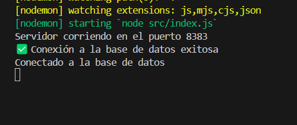

# Proyecto Final - BACKEND 🛒

Este es un proyecto full-stack que consiste en una aplicación para la gestión de productos, pedidos, categorías y usuarios.
## Instalar la dependencias
```
npm install
```

### Ejecutar con
```
npm run serve
```

### ejecucion de la base de datos




